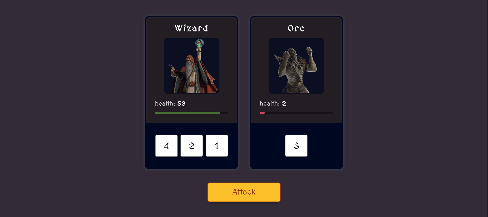

# Medieval Dice Game [Scrimba Module 7 Project]

This is a vanilla javascript project I built taking the Frontend Career Path at Scrimba.
Languages: Javascript, HTML, CSS

Building this project was a lot of fun and I learnt a lot. I learnt:

- How to destructure objects as well as mapping over arrays.
- The Array constructor, and how to chain methods together.
- I also learned how to use constructor functions and `Object.assign` method to assign properties to objects.
- How to use the `this` keyword to refer to the current object.
- Importing and exporting modules in Javascript.
- How to use the `.reduce()` method to iterate over an array.
- How to use the ternary operator to conditionally execute code.
- How to write super concise functions with arrow functions.
- I learnt about classes and how to use them to create objects.

## Demo

[Click](https://google.com/)

## Author 😊

**Benjamin Essilfie Ofori-Quansah** - [View Profile](https://github.com/essilfiequansah)

- [**Twitter**](https://twitter.com/essiIfie)
- [**Linkedin**](https://www.linkedin.com/in/essilfiequansah/)
